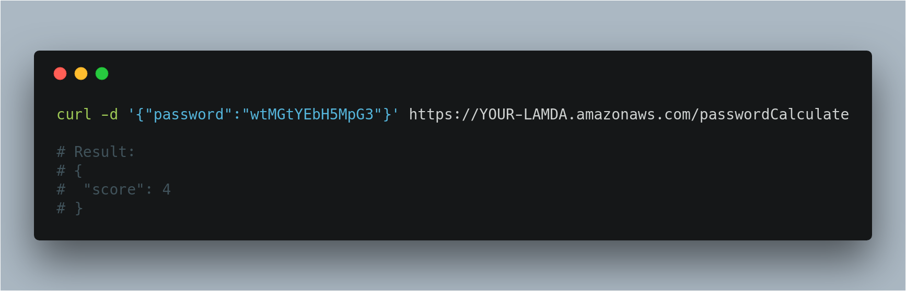

# ZXCVBN On Lambda
[](https://opensource.org/licenses/MIT)

Bring awesome [zxcvbn](https://github.com/dropbox/zxcvbn) - a password strength estimator to the cloud (AWS Lamda) with [serverless](https://github.com/serverless/serverless)



## Use case

Whenever you need a function to check user password. One minute and you will get it on AWS Lambda that can call everywhere.

## Quick install

First, you will need [serverless](https://github.com/serverless/serverless) framework configured AWS credentials.

Next, clone this repo and re-deploy

```bash
git clone https://github.com/stephentt-me/zxcvbn-on-lambda.git
cd zxcvbn-on-lambda
serverless deploy
```
And your function is ready!

## Using

Make a REST API call:

```bash
curl -H 'Content-Type: application/json' -d '{"password":"xyz"}' https://YOUR-LAMDA.amazonaws.com/PATH
```

## Reference

* [zxcvbn: Low-Budget Password Strength Estimation](https://www.usenix.org/conference/usenixsecurity16/technical-sessions/presentation/wheeler)

## License

MIT. See [LICENSE](LICENSE) for more information.